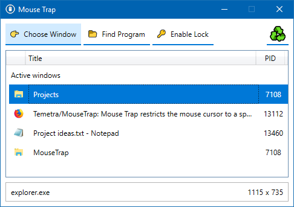
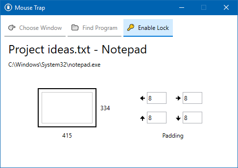
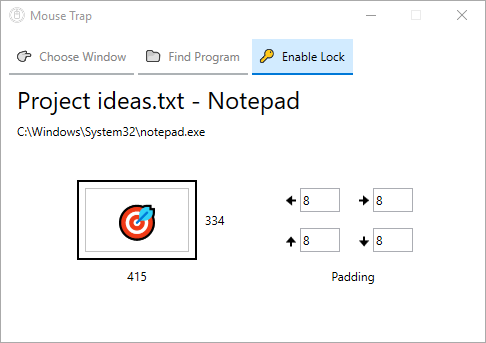

<h1>Mouse Trap</h1>

![Last commit][commit]
![Issues][issues]
![Language][language]
![License][license]

Mouse Trap restricts the mouse cursor to a specific window.

This can help when the cursor shouldn't wander outside to talk to other windows, but the program fails to capture the mouse normally. Some game examples are; Morrowind, Oblivion, Skyrim, Fallout 3, Fallout: New Vegas and Fallout 4.

Particularly useful for dual-monitor setups, but can be used for any number of displays greater than zero.

 

## Download

Mouse Trap can be downloaded from the [releases page](https://github.com/Temetra/MouseTrap/releases).

## Details

* This is a Windows WPF application.
* Designed and tested on Windows 10.
* Compatibility with Window 7 (currently untested).
* Requires [.NET Framework 4.7.2](https://docs.microsoft.com/en-us/dotnet/framework/install/on-windows-10).

## Instructions

### Choosing a window to lock

A window can be chosen from a list of currently open applications. Enabling the lock will restrict the mouse to the boundaries of the window, whenever that window has focus. Switching to another program will free the mouse (<kbd>Alt</kbd>+<kbd>Tab</kbd>), allowing you to unlock the window.

### Specifying a program

Alternatively, a specific executable path can be entered. When the lock is enabled, Mouse Trap waits until the first window for this executable gains focus.

### Enabling the mouse lock

Once the lock is enabled, the mouse will be limited to the boundaries of the window whenever it has focus. The boundary can be adjusted using the "padding" values, to increase or decrease the restricted area.

 

### Once the lock is active

An indicator appears when the window has focus. The mouse is now locked to the window. To cancel the lock, switch to another window (<kbd>Alt</kbd>+<kbd>Tab</kbd>); or the window can be closed.

If the window is closed, the application returns to the list or file tab.

## Built With

* [Windows Presentation Foundation (WPF)](https://docs.microsoft.com/en-us/visualstudio/designers/introduction-to-wpf?view=vs-2017) - Desktop client framework
* [Emoji.Wpf](https://github.com/samhocevar/emoji.wpf) - A proof of concept implementation of Emoji for WPF

## License

This project is licensed under the MIT License - see the [LICENSE.md](LICENSE.md) file for details

## Acknowledgments

* [denizimo01 on Pixabay](https://pixabay.com/en/mouse-mouse-icon-symbol-pc-cursor-2487884/) for the logo
* [Patterns - WPF Apps With The Model-View-ViewModel Design Pattern](https://msdn.microsoft.com/en-us/magazine/dd419663.aspx#id0090030) for RelayCommand class

[commit]: https://img.shields.io/github/last-commit/Temetra/MouseTrap.svg?style=flat
[issues]: https://img.shields.io/github/issues/Temetra/MouseTrap.svg?style=flat
[language]: https://img.shields.io/github/languages/top/Temetra/MouseTrap.svg?style=flat
[license]: https://img.shields.io/badge/license-MIT-blue.svg
